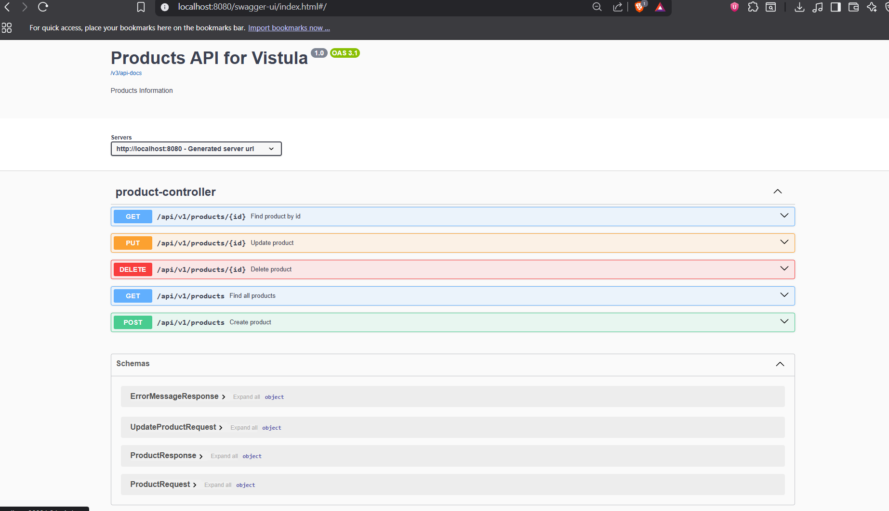
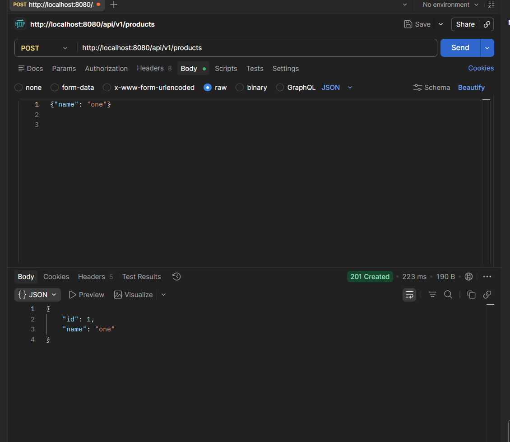
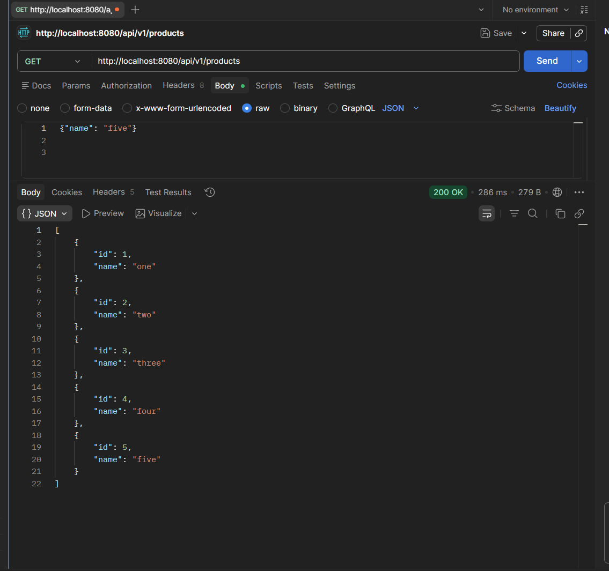
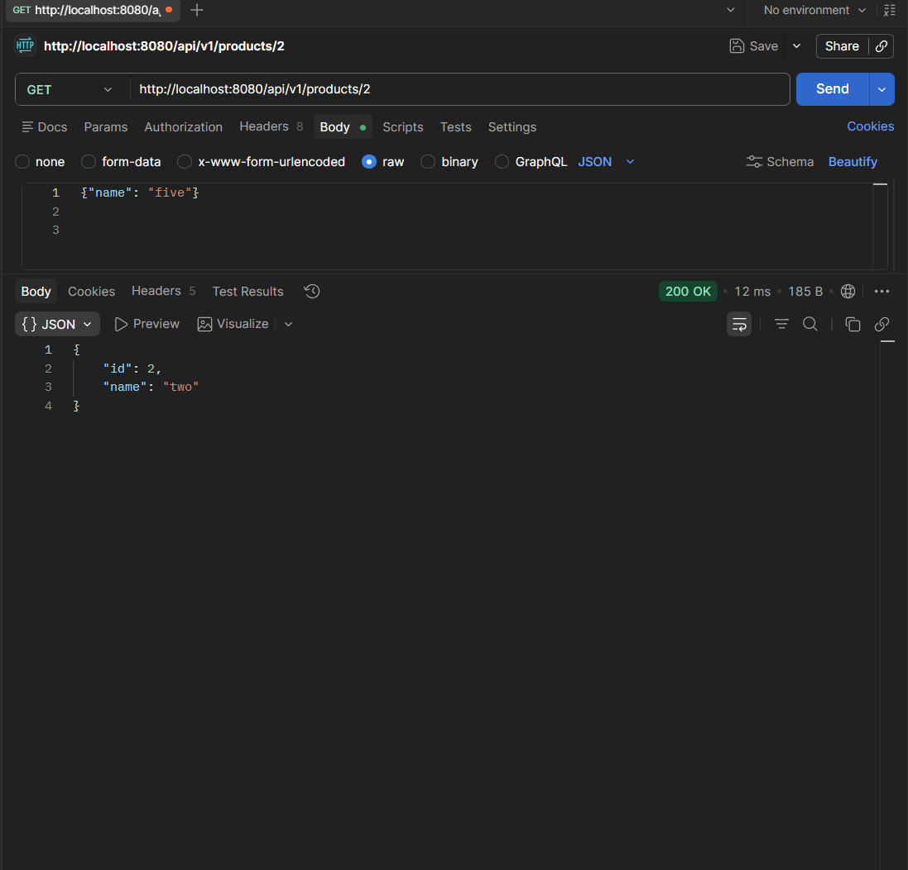
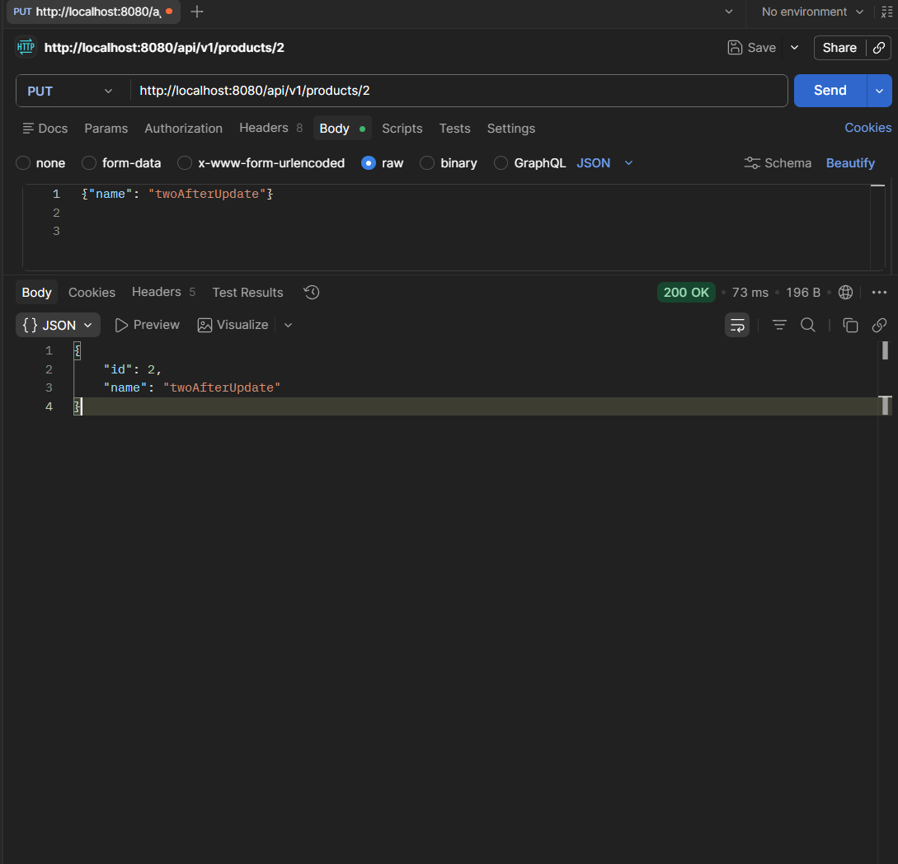
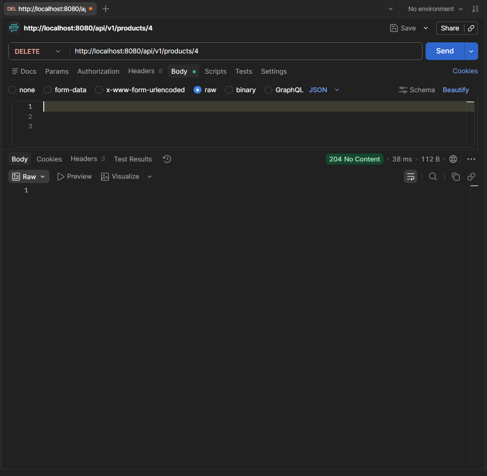
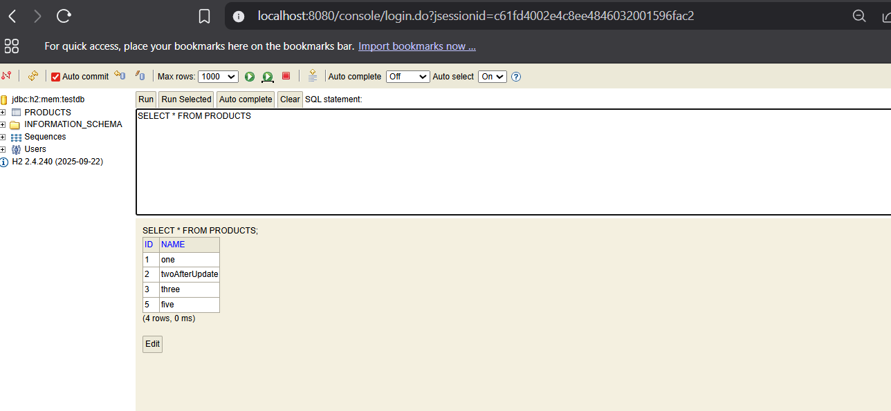

# First REST API Spring

A REST API application built with Spring Boot for the
Spring Framework course at Vistula University.

## Technologies Used
- Java 25
- Spring Boot 4.0.6
- Spring Data JPA
- H2 Database
- Swagger UI (OpenAPI)
- Maven

## How to Run
1. Clone this repository
2. Open it in IntelliJ IDEA
3. Run the main application class
4. Open your browser and go to `http://localhost:8080`

## Testing the API
You can test this application in three ways:
- **Postman** - send HTTP requests manually
- **Swagger UI** - `http://localhost:8080/swagger-ui/index.html`
- **H2 Console** - `http://localhost:8080/console`

## Database
This application uses H2 - a lightweight in-memory database.
Data is stored while the application is running but resets on restart.

To view the database:
1. Go to `http://localhost:8080/console`
2. Change JDBC URL to `jdbc:h2:mem:testdb`
3. Click Connect
4. Run SQL queries like `SELECT * FROM PRODUCTS`

## Endpoints

---

### POST /api/v1/products
Creates a new product.

**Request body:**
```json
{
    "name": "Product name"
}
```

**Response (201 Created):**
```json
{
    "id": 1,
    "name": "Product name"
}
```

---

### GET /api/v1/products
Returns a list of all products.

**Response (200 OK):**
```json
[
    { "id": 1, "name": "First product" },
    { "id": 2, "name": "Second product" }
]
```

---

### GET /api/v1/products/{id}
Returns a single product by ID.

**Example:** `GET /api/v1/products/1`

**Response (200 OK):**
```json
{
    "id": 1,
    "name": "First product"
}
```

**If product not found (404):**
```json
{
    "message": "Product with 999 not found"
}
```

---

### PUT /api/v1/products/{id}
Updates an existing product by ID.

**Example:** `PUT /api/v1/products/1`

**Request body:**
```json
{
    "name": "Updated name"
}
```

**Response (200 OK):**
```json
{
    "id": 1,
    "name": "Updated name"
}
```

---

### DELETE /api/v1/products/{id}
Deletes a product by ID.

**Example:** `DELETE /api/v1/products/1`

**Response:** 204 No Content

**If product not found (404):**
```json
{
    "message": "Product with 999 not found"
}
```

---

## HTTP Methods Summary

| Method | URL | Description | Response Code |
|--------|-----|-------------|---------------|
| POST | /api/v1/products | Create product | 201 Created |
| GET | /api/v1/products | Get all products | 200 OK |
| GET | /api/v1/products/{id} | Get product by id | 200 OK |
| PUT | /api/v1/products/{id} | Update product | 200 OK |
| DELETE | /api/v1/products/{id} | Delete product | 204 No Content |


## Project Structure

```
firstrestapispring/
├── product/
│   ├── api/
│   │   ├── request/
│   │   │   ├── ProductRequest
│   │   │   └── UpdateProductRequest
│   │   ├── response/
│   │   │   └── ProductResponse
│   │   └── ProductController
│   ├── domain/
│   │   └── Product
│   ├── repository/
│   │   └── ProductRepository
│   ├── service/
│   │   └── ProductService
│   └── support/
│       ├── exception/
│       │   └── ProductNotFoundException
│       ├── ProductExceptionAdvisor
│       ├── ProductExceptionSupplier
│       └── ProductMapper
└── shared/
    └── api/
        └── response/
            └── ErrorMessageResponse
```
---

## Architecture Overview

This project follows a layered architecture:

- **Controller** - Handles HTTP requests and responses
- **Service** - Contains business logic
- **Repository** - Handles database operations
- **Domain** - Core data objects
- **Mapper** - Converts between Request/Domain/Response objects

---

## Screenshots
### Swagger UI


---

### POST - Create Product


---

### GET - Get All Products


---

### GET - Get Product By ID


---

### PUT - Update Product


---

### DELETE - Delete Product


---

### H2 Database Console


